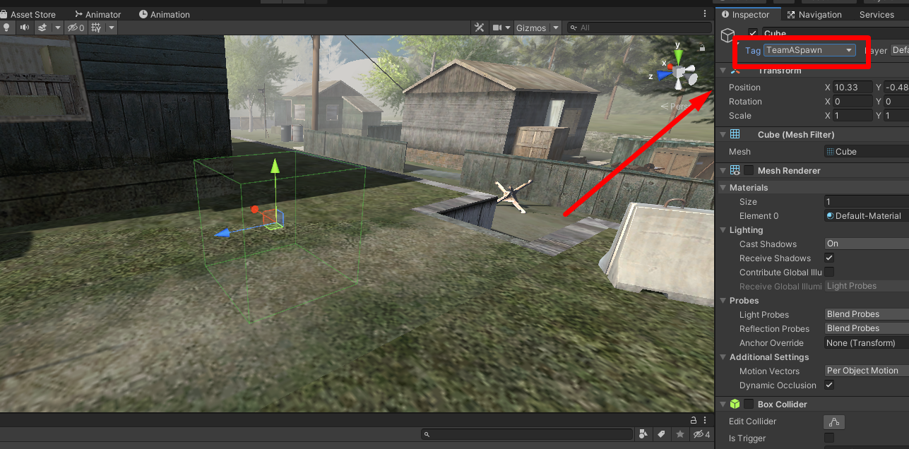

# Adding tags

Now you need to set tags on the objects.
## List of all main tags:
- `TeamASpawn`
	- Spawn point of Team A (Players)
- `TeamBSpawn`
	- Spawn point of Team B (Monsters)
- `custardPos`
	- Custard spawn point. If there are more spawn points than the selected number of custards in the game, then the custards will spawn at random spawn points.
- `ShopPoint`
	- A helicopter will arrive at this point or a supply box will spawn (survival mode).

## Surface tags
- `Dirt`
- `Rock`
- `Metal`
- `Wood`

