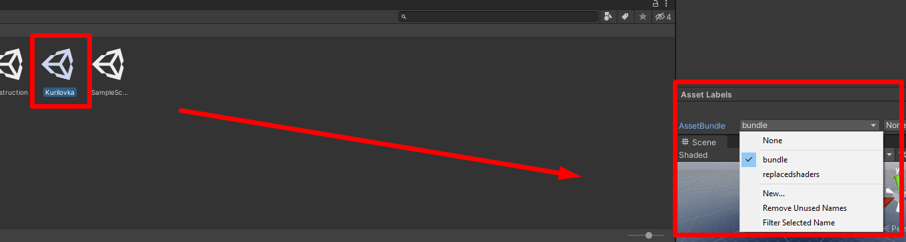
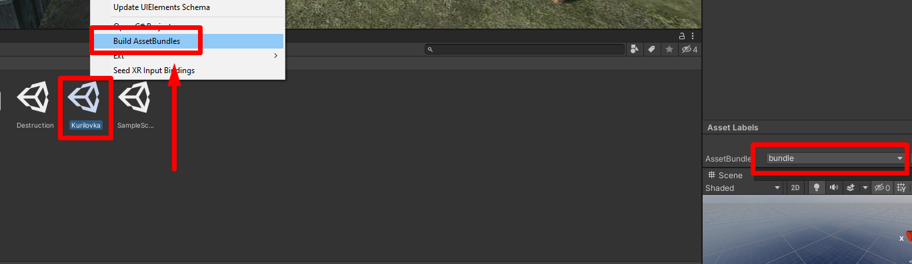

# Building a bundle

When the scene is completely ready, you need to build an assetbundle.

To do this, [download](https://drive.google.com/file/d/1Cbo03rs1TeHchbdpxCwS1oHoaD2sQRif/view?usp=drive_link) and move the Editor folder to the Assets folder of your project.
After unity compiles the new scripts, select your scene in the explorer and create a new asset bundle named **bundle** in the Asset Labels panel, then right-click > build AssetBundles.

After the script completes its work, your finished bundle will be in the **Assets/AssetBundles** directory.

