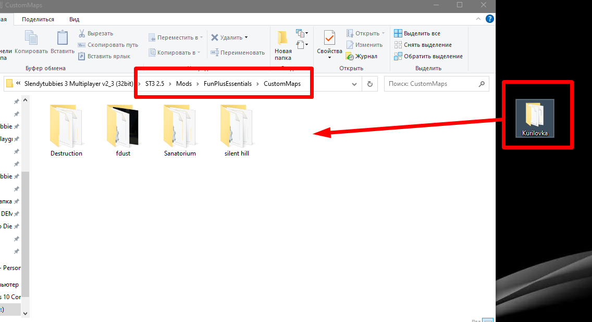

# Installing the custom map

After completing the configuration, move the folder with the map to the `Mods/FunPlusEssentials/CustomMaps` directory.

If everything is done correctly, the map will appear in the S2 Maps section.

