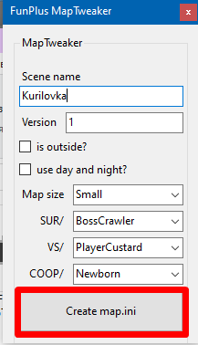
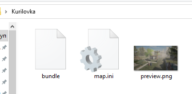

# Creating map.ini

Create a new folder where the map files will be located. Drag and drop the bundle file there. 

If you want, you can create an in-game preview for the map. 
- The preview should be in .png format
- The file name should be `preview`
- The image size should be 256x160

Now you need to run MapTweaker.exe
Fill in all the fields.
- Scene name
	- The name of your map. **The name must match the name of the scene in unity**.
- Version
	- The version of the map. The player will not be able to enter the room if his version of the map does not match the version of the master.
- Is outside?
	- If enabled, a helicopter will arrive at the shop points in survival mode, otherwise supply boxes will be spawned.
- Use day and night?
	- Time of day system is not available at the moment, ignore this option.
- Map size
	- The size of your map.
- SUR/
	- Survival boss.
- VS/
	- Versus monster.
- COOP/
	- Collect monster.

