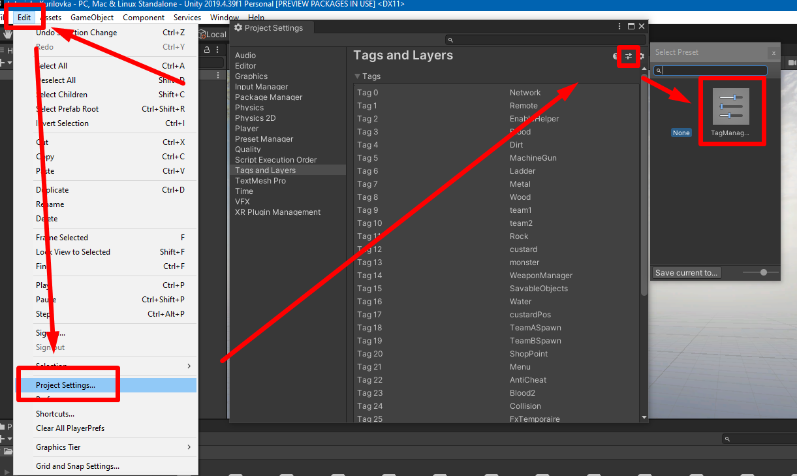

# Setup tags preset

After creating the scene, you need to add tags, otherwise the map will not function in the game.
- [Download](https://drive.google.com/file/d/1Cbo03rs1TeHchbdpxCwS1oHoaD2sQRif/view?usp=drive_link) the preset with all the tags from the game.
- Move the TagManager.preset file to the Assets folder of your project.
- In unity, go to Edit > Project Settings > Tags and layers and click on the settings button in the upper right corner. 
- After that, the assets browser will open in which you need to select our preset.

Preset installation is complete, go to the next step.