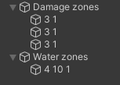

# Triggers

In addition to the tags from the game, the FunPlusEssentials mod also adds a trigger system.
To use the trigger system, create an empty GameObject and name it with the trigger name, for example "Killzones". Now all child objects will be considered as triggers.
To create a trigger zone, create any primitive GameObject, such as a cube, and check the `isTrigger` parameter in the collider component.
If the trigger accepts parameters, the object name must contain **only** parameters.

## List of all available trigger names:
- `Killzones`
	- Instantly kills the player. It does not accept parameters.
- `Damage zones`
	- Deals `damage` every `cooldown` seconds. Parameters: `damage` `cooldown`
- `Water zones`
	- Simulates underwater physics. If `damage` is greater than zero, it deals damage. Parameters: `gravity` `damage` `cooldown`

